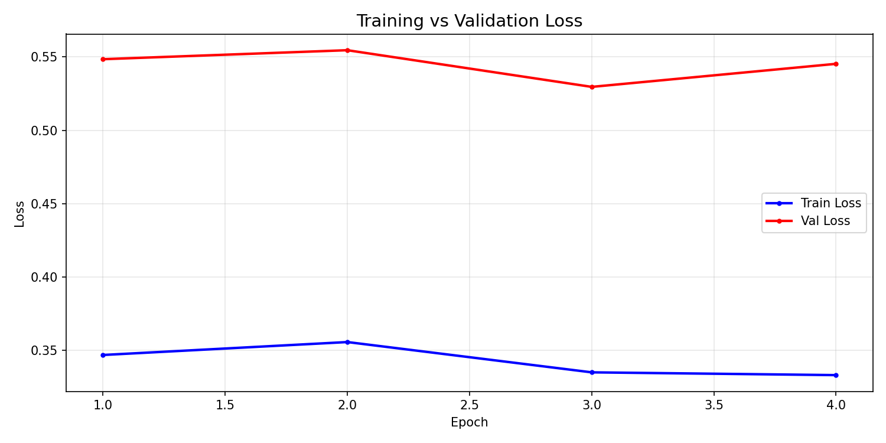
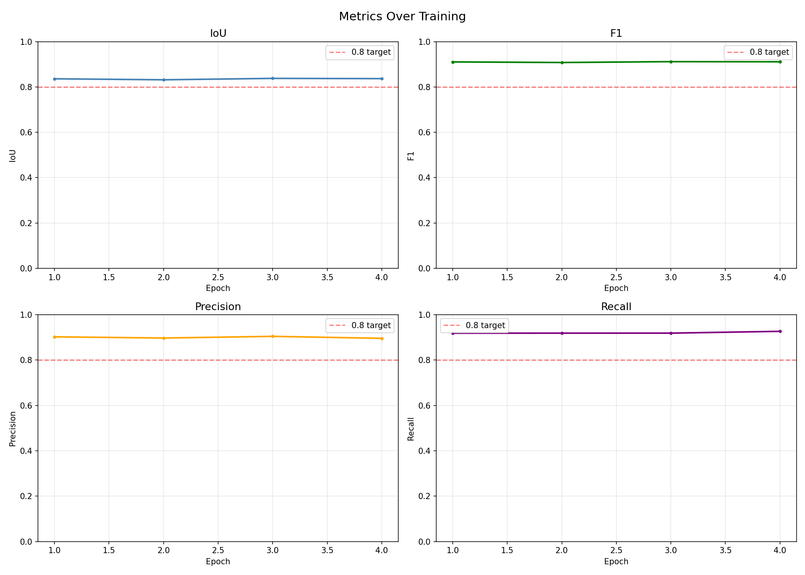
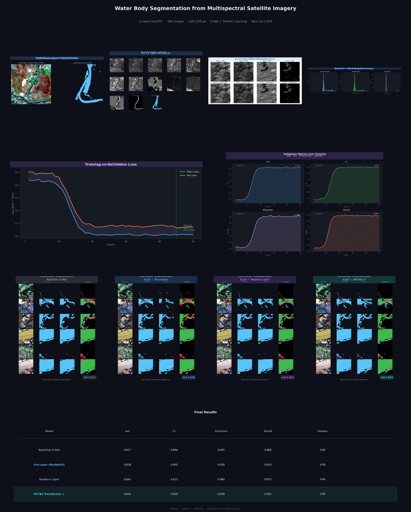
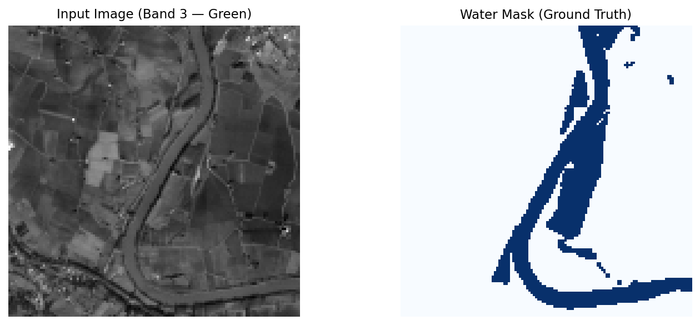

# 🌊 Water Body Segmentation using Deep Learning

A deep learning pipeline for semantic segmentation of water bodies from 12-band multispectral satellite imagery, leveraging custom U-Net architectures and transfer learning.


---

## 📋 Table of Contents

- [Overview](#-overview)
- [Results](#-results)
- [Dataset Details](#-dataset-details)
- [Model Architectures](#-model-architectures)
- [Project Structure](#-project-structure)
- [Installation](#-installation)
- [Usage](#-usage)
- [Training Details](#-training-details)
- [Visualizations](#-visualizations)
- [Key Findings](#-key-findings)
- [Future Work](#-future-work)
- [Author Section](#-author)

---

## 🎯 Overview

Accurate water body detection from satellite imagery is critical for flood monitoring, water resource management, and environmental conservation. This project trains a robust deep learning model to produce pixel-level binary masks separating water from non-water regions across diverse satellite scenes.

### Key Features

- **Multi-Band Processing**: Uses all 12 spectral bands (Visible, NIR, SWIR) instead of just RGB.
- **Robust Preprocessing**: Built-in detection and handling of Sentinel-2 missing data signatures (`-9999` NaN poisoning).
- **Advanced Transfer Learning**: Explores multiple adaptation strategies (Pre-layer, Replace-layer, Transformer Encoders) to map 12-channel inputs to standard 3-channel pretrained backbones.
- **Micro-batch Optimization**: Optimized for learning on a small dataset (306 images) using aggressive augmentation and early stopping.

---

## 📊 Results

### Performance Summary

| Model | IoU | F1 / Dice | Precision | Recall |
|---|---|---|---|---|
| U-Net from Scratch | 0.817 | 0.896 | 0.905 | 0.888 |
| Transfer — Pre-Layer (ResNet50) | 0.828 | 0.905 | 0.958 | 0.859 |
| Transfer — Replace Layer (ResNet50) | 0.842 | 0.913 | 0.960 | 0.873 |
| Transfer — MiT-B2 Transformer (**Best**) | **0.854** | **0.920** | 0.939 | **0.903** |

### Ground Truth vs Predictions

<p align="center">
  
</p>

### Training Curves and Progress

<p align="center">
  
  
</p>

### Comprehensive Visuals

Check out the consolidated overview poster containing all data visualizations:
<p align="center">
  
</p>

---

## 📁 Dataset Details

### Properties

- **Source Images**: 306 multispectral GeoTIFF files
- **Channels**: 12 diverse spectral bands per image
  - `B01` - Coastal, `B02` - Blue, `B03` - Green, `B04` - Red
  - `B05/06/07` - Veg Red Edge, `B08` - NIR, `B8A` - Narrow NIR
  - `B09` - Water Vapor, `B11/B12` - SWIR 1/2
- **Resolution**: 128 × 128 pixels minimum
- **Labels**: Binary masks (1 = Water, 0 = Non-Water background)
- **Data Splitting**: 70% Training / 15% Validation / 15% Testing

### Preprocessing Pipeline

```text
Raw .tif → Handle Missing Data → Compute Global Stats → Normalize
```

**Key Challenge & Solution**: 
Band 9 contained `-9999` sentinel values (satellite no-data flag) in multiple images where the entire band was corrupted. If left unhandled, this caused `NaN` propagation throughout the neural network. The pipeline was engineered to proactively detect these fully corrupted bands and replace them with `0` before computing the dataset-wide normalization statistics.

---

## 🏗️ Model Architectures

The project extensively evaluates four distinct network topologies to handle the shift from 3-channel (RGB) to 12-channel multispectral inputs.

### 1. Base U-Net (From Scratch)
A traditional encoder-decoder architecture constructed fundamentally for 12-channel input tensors, offering a strong baseline without external weights.

### 2. Pre-Layer U-Net (ResNet50)
A frozen, pretrained `ResNet50` (expecting 3 channels) is prepended by an untrained `1x1` convolution layer mapping `12 channels → 3 channels`. This lets the network learn a trainable projection while leveraging high-quality ResNet weights.

### 3. Replace-Layer U-Net (ResNet50)
The first layer of the pretrained `ResNet50` is completely excised and dynamically replaced by a new `7x7` convolution layer initialized from scratch that expects 12 channels.

### 4. Transformer-based U-Net (MiT-B2)
A Mix Transformer encoder (MiT-b2) adapted identically using the `Replace-Layer` mechanics. This leverages profound self-attention, vastly outperforming CNN counterparts in spatial coherence handling.

---

## 🚀 Installation

### Requirements

- Python 3.10+
- PyTorch (>= 2.0.0)
- Rasterio (>= 1.3.0)
- Segmentation Models PyTorch (SMP)
- Matplotlib, NumPy, tqdm

### Setup Process

1. **Clone the repository**
```bash
git clone https://github.com/AlBaraa63/water-segmentation.git
cd water-segmentation
```

2. **Establish Environment (Recommended)**
```bash
python -m venv venv
venv\Scripts\activate     # Windows
# source venv/bin/activate  # Linux/Mac
```

3. **Install dependencies**
```bash
pip install -r requirements.txt
```

---

## 💻 Usage

### Execute Pipeline Interactively
Explore the curated notebooks sequentially for a granular walkthrough:
```text
notebooks/
├── 01_data_exploration.ipynb
├── 02_preprocessing.ipynb
└── 03_transfer_learning.ipynb
```

### Run Baseline Model
To initiate the standard from-scratch U-Net training pipeline:
```bash
python main.py
```

### Run Transfer Learning Suite
To sequentially train and evaluate all transfer architectures:
```bash
python scripts/run_all_experiments.py

# Continue from pre-ran checkpoints:
python scripts/run_all_experiments.py --skip-done

# Target an explicit experiment (e.g., Transformer model):
python scripts/run_all_experiments.py --only exp3
```

---

## 📂 Project Structure

```
water-segmentation/
├── config.py                  ← Central configuration panel (Paths & Hyperparams)
├── main.py                    ← End-to-end U-Net baseline run script
├── requirements.txt           ← Project dependencies
│
├── data/
│   ├── raw/                   ← Original unregistered .tif files
│   └── processed/
│       └── stats.json         ← Computed global statistics tracker
│
├── notebooks/                 ← Walkthroughs and experimentation grounds
│   ├── 01_data_exploration.ipynb
│   ├── 02_preprocessing.ipynb
│   └── 03_transfer_learning.ipynb
│
├── src/                       
│   ├── preprocessing.py       ← Data loading, cleansing (NaN), scaling
│   ├── dataset.py             ← PyTorch Dataset & DataLoader schemas
│   ├── train.py               ← Epoch training engine + Loss/Metrics logging
│   ├── evaluate.py            ← Evaluation suite + Matrix generators
│   ├── visualize.py           ← Image creation modules
│   └── models/
│       ├── unet_scratch.py    ← Custom U-Net Base 
│       ├── unet_prelayer.py   ← Experiment 1 Architecture
│       ├── unet_replace.py    ← Experiment 2 Architecture
│       └── unet_satellite.py  ← final SMP models orchestrator
│
├── scripts/
│   └── run_all_experiments.py ← Script wrapping multiple transfer learning jobs
│
└── outputs/
    ├── checkpoints/           ← Saved PyTorch .pth states
    ├── plots/                 ← Generated charts, confusion matrices, composites
    ├── predictions/           ← Raw exported boolean targets
    ├── logs/                  
    └── results/               ← JSON metrics outputs per trial
```

---

## 📈 Training Details

### Configuration

| Hyperparameter | Value |
|----------------|-------|
| Target Metric | Intersection over Union (IoU) |
| Optimizer | Adam |
| Batch Size | 16 |
| Initial Learning Rate | 0.001 |
| Max Epochs | 150 |
| Early Stopping | 15 epochs without improvement |
| Seed | 42 |

### Performance Evaluation Logic
Models are evaluated on an unseen 15% testing split using multiple robust indices:
- **IoU (Jaccard Index)**: The primary success metric indicating mask alignment quality.
- **F1 (Dice Coefficient)**: Balances Precision metrics and False Negative impacts.
- **Precision / Recall**: Diagnostic insight into false alarms and omission ratios. 

---

## 🎨 Visualizations

The testing suite automatically outputs graphical insight arrays into `outputs/plots/`. 

| Target Visual | Plot Content Description |
|---------------|--------------------------|
| `all_bands.png` | Separate greyscaled instances of all 12 input bands |
| `image_vs_mask.png` | RGB composite versus corresponding ground truth |
| `band_distributions.png`| Histogram plotting pixel frequencies pre-normalization |
| `before_after_norm.png` | Visual effect of applying `stats.json` standardization |
| `first_batch.png` | TrainLoader integrity check sample output |
| `linkedin_poster.png` | Compiled end-to-end report presentation |

Sample Output: Base image extraction showcasing raw array structures.
<p align="center">
  
</p>

---

## 🔍 Key Findings

1. **Self-Attention Wins**: The MiT-B2 transformer encoder significantly over-performed CNN approaches, confirming spatial attention mechanisms uniquely excel at deciphering scattered satellite band signatures.
2. **Transfer Timeframes**: The `Pre-layer` (Exp1) method initially trained faster and scored higher at ~50 Epochs; but the `Replace-layer` (Exp2) inherently adapts its deep-layer dependencies given adequate time—eventually surpassing the Pre-Layer over a 100-Epoch threshold.
3. **Information Overload Issue**: Employing a transfer-learning base achieved roughly a `~+0.037` base IoU lift over training entirely from scratch while maintaining exceptional parameter generalization over a very small 306-image corpus.

---

## 🔮 Future Work

- [ ] **Temporal Analysis**: Ingest sequential multispectral imagery to isolate permanent bodies from transient seasonal shifts.
- [ ] **Cross-Validation Implementation**: Enforce K-Fold CV for hyper-robust reliability scores across all data partitions.
- [ ] **Extended Metrics**: Incorporate edge-aware topology losses to better trace complex shorelines.
- [ ] **Cloud Deployment Interface**: Set up automated edge inferencing pipelines utilizing Docker and FastAPI frameworks.

---

## 👤 Author

**AlBaraa AlOlabi**  
Computer Vision Engineering Intern at Cellula Technologies

*(Incorporated Best Practices derived from the classification protocols at Cellula Technologies)*

---

## 📄 License & Acknowledgments

This project is part of an internship program at Cellula Technologies.  
Special thanks to mentors and data curators guiding this project format.
