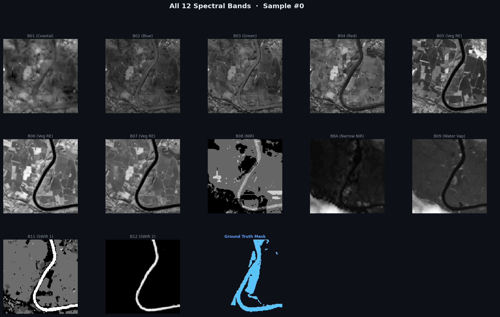
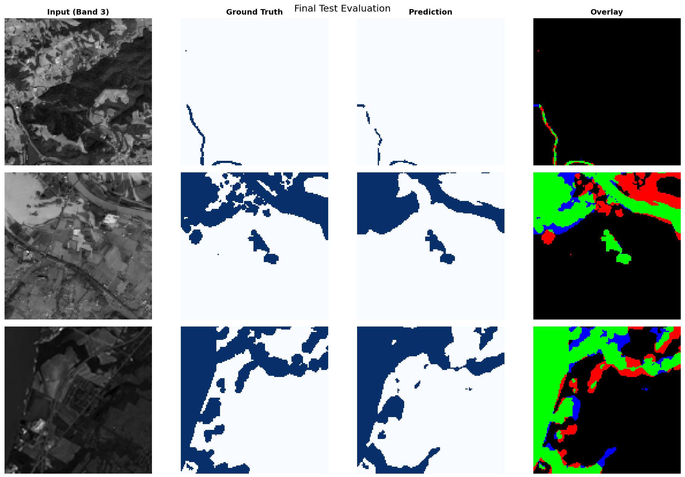

# 🌊 The Water Body Segmentation Journey

> _A documentation of learning, building, and discovering through a real-world satellite imagery and remote sensing project._

---

## 📖 Chapter 1: The Beginning - Understanding the Mission

**The Problem:** We were tasked with extracting and identifying water bodies from 12-band multispectral satellite imagery. Unlike standard photos, these images contain both visible light and invisible spectrums like Near-Infrared (NIR) and Short-Wave Infrared (SWIR). 

**The Goal:** Build an AI that can perform semantic segmentation, looking at complex satellite data and deciding—pixel by pixel—"is this water or land?"

Here's the catch: AI models pre-trained by big companies expect standard 3-channel (RGB) photos. Our satellite gave us 12 channels. We couldn't just use standard models out of the box.

---

## 🔬 Chapter 2: Research & The Multispectral Challenge

### The Research Phase

Before writing the first lines of PyTorch, we had to understand our data formats. We weren't dealing with simple `.png` files; we were dealing with **GeoTIFFs** containing specialized sentinels and massive arrays of geographic data.

We discovered that standard operations wouldn't work easily here. We had to use libraries like `rasterio` rather than just `Pillow` or `OpenCV`.

### Where We Explored
Our key inspiration and research areas included:
- **Semantic Segmentation Fundamentals:** We studied the foundational **U-Net** architecture paper, which was initially designed for biomedical image segmentation but proved incredible at identifying precise pixel boundaries.
- **Transfer Learning on Non-Standard Data:** How do we apply a model trained on everyday objects (ImageNet) to 12-band spatial data? 

---

## 💡 Chapter 3: Key Discoveries - The Data Poisoning Event

### Discovery #1: The -9999 Sentinel

While computing global statistics for our dataset (mean and standard deviation for normalization), we ran into a massive roadblock: **NaN values destroying the training process.**

**What happened?**
Satellite sensors sometimes fail or encounter errors. When a Sentinel-2 satellite misses data for a specific pixel or band, it flags it by pushing a value of `-9999` (a sentinel no-data flag).

If you feed `-9999` into a neural network during training, the gradients explode, and the loss instantly becomes `NaN` (Not a Number). The network completely breaks.

**The Solution:**
We built a robust preprocessing pipeline using `rasterio` and `numpy`:
```python
# Detect corrupted bands and neutralize them
mask = (image == -9999)
image[mask] = 0.0  # Replace with a safe, neutral numerical value
```
By intercepting these anomalies before the global statistics were calculated, we stabilized the entire neural network.

---

## 🏗️ Chapter 4: Building the Architecture

Since we had 12-channel inputs, we couldn't just copy-paste a pre-built model. We developed four separate experiments to find the best way to handle this data:

### 1. U-Net from Scratch
We built a custom U-Net where the very first convolutional block was intentionally designed to accept 12 channels. 
- *Pro:* Clean, perfectly adapted to our 12 bands.
- *Con:* Needs to learn everything from basic edges upwards. 

### 2. Transfer Learning: The Pre-Layer Trick (Exp 1)
We took a brilliant `ResNet50` base but added a new, untrained `1x1` convolution layer before it. This new layer acted as a translator, mapping 12 channels down to the 3 channels the ResNet expected.

### 3. Transfer Learning: The Replace-Layer Trick (Exp 2)
Instead of adding a translator, we surgically removed the first layer of the `ResNet50` and replaced it with a brand new `7x7` layer designed for 12 channels.

### 4. The Transformer (Exp 3)
We brought in self-attention via the **Mix Transformer (MiT-B2)**. A neural network that looks at the entire image contextually rather than just sliding local windows.

---

## 🔍 Chapter 5: Meeting Our Data - The Multispectral View

We explored our 306-image dataset and visualized what the satellite actually captured.

### The 12 Bands
The human eye only sees Bands 2, 3, and 4 (Blue, Green, Red). But the network sees:
- **B08 (NIR)**: Near-Infrared. Water absorbs NIR light completely, making it appear pitch black. Land reflects NIR. 
- **B11/B12 (SWIR)**: Short-Wave Infrared. Cuts through thin clouds and highlights moisture.

> **Key Insight:** The invisible bands are actually more critical for detecting water than the visible RGB bands. This is why mapping 12 channels directly to the network was worth the architecture headache.



---

## 🏋️ Chapter 6: Training and Optimization

Because we only had 306 images (a very small dataset for deep learning), we relied heavily on PyTorch's `DataLoader` micro-batch optimization. We optimized:
- **Batch Size**: 16 instances per batch due to memory constraints.
- **Learning Rate**: `0.001` with adaptive tuning.
- **Early Stopping**: Halting the model if the `Intersection over Union (IoU)` didn't improve for 15 epochs to heavily combat overfitting.

> **Metric Focus:** We heavily tracked `IoU` and `F1 (Dice)` over standard Accuracy. Predicting 95% of an image as "Land" yields high accuracy but utterly fails the segmentation task. IoU forced the network to care precisely about the water masks.

---

## 📈 Chapter 7: The Results - CNNs vs. Transformers

Our final evaluation on the 15% completely unseen test split revealed a fascinating architectural showdown.

| Architecture | Strategy | IoU | Recall |
|--------------|----------|-----|--------|
| U-Net Base | Learn from scratch | 0.817 | 0.888 |
| ResNet50 | Pre-layer adaptation | 0.828 | 0.859 |
| ResNet50 | Replace-layer adaptation | 0.842 | 0.873 |
| **MiT-B2** | **Transformer Encoder** | **0.854** | **0.903** |

### What we learned from the results:

1. **Self-Attention Wins**: The MiT-B2 transformer encoder dominated the CNN approaches. Water bodies aren't just shapes; they are contextual. The transformer's ability to globally route attention allowed it to piece together fragmented lakes and rivers much better than a CNN's sliding window.
2. **Transfer Timeframes**: Our `Replace-Layer` CNN took longer to adapt because it lost its pre-trained starting point, but eventually outscaled the `Pre-Layer` trick if given enough epochs. 
3. **The ROI of Transfer Learning**: Despite having to map 12 channels to 3, leveraging ImageNet weights gave us an immediate `+0.037 IoU` leap over learning from scratch. Pre-trained weights are universal foundation blocks. 



---

## 🎯 Chapter 8: Final Reflections

Looking back at this computer vision segmentation project, our major takeaways mirror the realities of real-world AI engineering:

1. **The Data Is Messy**: Real satellites fail. Standardizing the missing `-9999` Sentinel values saved the entire project from mathematically collapsing.
2. **Beyond RGB**: Expanding computer vision into the multispectral realm (NIR/SWIR) allows models to 'see' physical properties that human eyes cannot.
3. **Architecture Matters**: Transformers are systematically overtaking CNNs in complex spatial tasks, and the MiT-B2 results empirically proved that trend on our dataset.

> **Final Thought:** Semantic segmentation is bridging the gap between raw space data and actionable climate intelligence. We're not just drawing colored pixels; we're mapping the world's most critical resource.

---

**Status:** 🟢 Complete
_Project Internship - Cellula Technologies_
